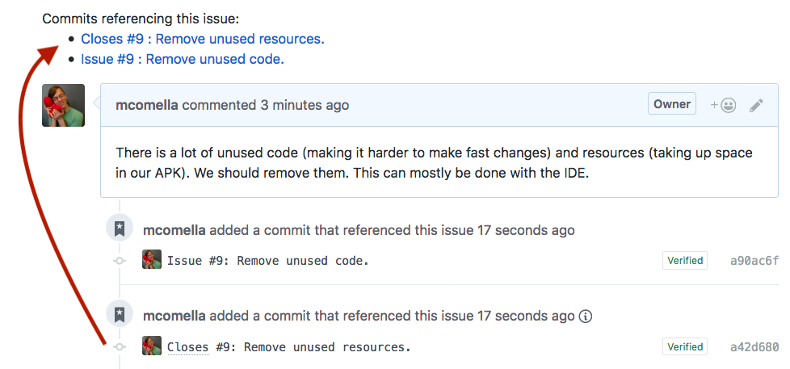

# GitHub Issue Hoister
[Available on addons.mozilla.org](https://addons.mozilla.org/en-US/firefox/addon/github-issue-hoister/)

When looking at a Github issue, the Github Issue Hoister is intended to help answer the question: "Are there any PRs open for this issue?"

To do this, it takes the links that already links already present in a Github page, such as "Commits that reference this issue", and hoists them to the top of the page:



You can generally click these links to navigate between issues and PRs. However, these links are not always reliable: see [the tutorial][] for more information.

### Alternatives
I only looked briefly but I saw no other existing alternatives.

A more complex but comprehensive solution would be to listen for the pull
request webhook and respond by writing the connecting issue <-> pr information
directly into the issues. A few trade-offs:
- Requires a server
- It needs to be explicitly added to individual repositories

This work [is currently in progress][kotbot].

## Development
For an example on how to develop WebExtensions with Firefox, see [here][webex].

To build, run the script:
```sh
./build.sh
```

which will write the file to `out/bundle.xpi`.

Here are some issues to use while testing:
- [Issue: Simple "Issue" and "Closes"](https://github.com/mozilla-mobile/firefox-tv/issues/293)
- [Issue: contains duplicate commits](https://github.com/mozilla-mobile/firefox-tv/issues/295)
- [PR: addresses two issues](https://github.com/mcomella/Spoon-Knife/pull/7)

## License
The license included with this repository is based on the X11 license, which is
similar to the MIT license.

[kotbot]: https://github.com/mcomella/moz_mobile_github_helper
[webex]: https://developer.mozilla.org/en-US/Add-ons/WebExtensions/Your_first_WebExtension
[the tutorial]: https://github.com/mcomella/github-issue-hoister/blob/master/docs/tutorial.md
