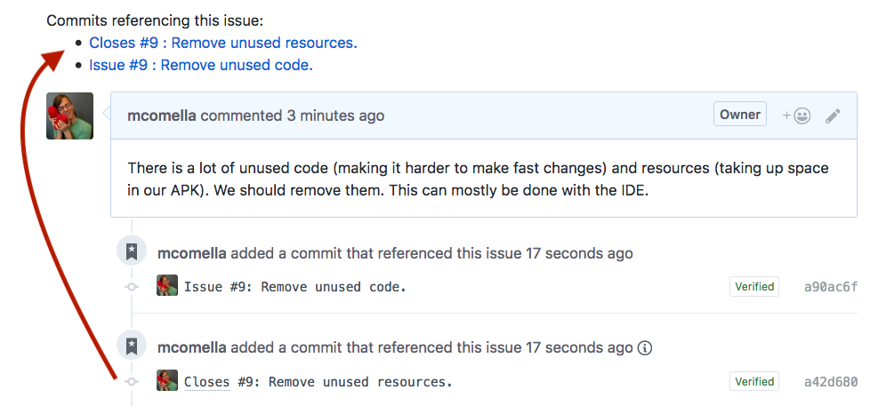
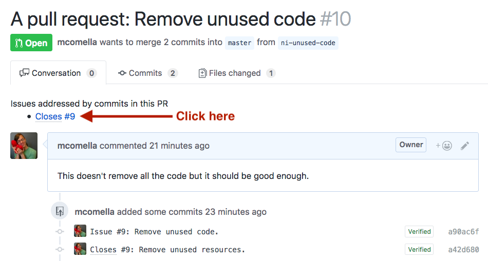
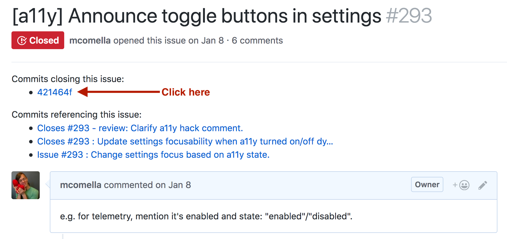
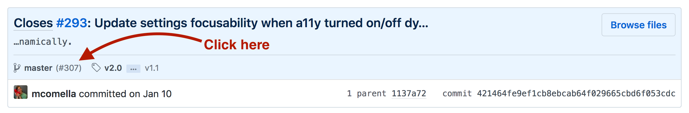

# Tutorial
When looking at a Github issue, the Github Issue Hoister is intended to help answer the question: "Are there any PRs open for this issue?"

To do this, it takes the links that already links already present in a Github page, such as "Commits that reference this issue", and hoists them to the top of the page:

You can generally click these links to navigate between issues and PRs. However, these links are not always reliable and that's what this guide will clarify.

## PR -> Issue
It's easiest to demonstrate moving from PRs to issues because these links are the most reliable.

When the Issue Hoister is able to extract an issue number from a commit message, these will be hoisted to the top of the PR page. You can click an issue number to be taken directly to that issue:

## Issue -> PR
Unfortunately, the links GitHub provides to PRs from an issue are less reliable. The Issue Hoister uses the following rules to provide the links that are most likely to link to a PR:
- The links most likely to have an associated PR are sorted top to bottom
- Duplicate commits are removed

To navigate from Issue -> PR, first click on a hoisted link:

This opens the associated commit page. If the commit has a PR open for it, the PR number will be linked and listed below the commit message, next to the branch. **Click this link to be taken to the issue!**

Note that not all commits will be associated with a PR:
- The commits could have been deleted from the PR
- GitHub lists duplicates commits on force pushes (we try to eliminate these)
- GitHub will sometimes reference commits that have *never* been part of a PR

The types of hoisted links are as follows:
- Commits closing this issue
- Commits referencing this issue
- (Not yet implemented: [#1][]) PRs/issues that reference this issue. Unfortunately, these may not actually be the PRs open to fix this issue.

[#1]: https://github.com/mcomella/github-issue-hoister/issues/1
